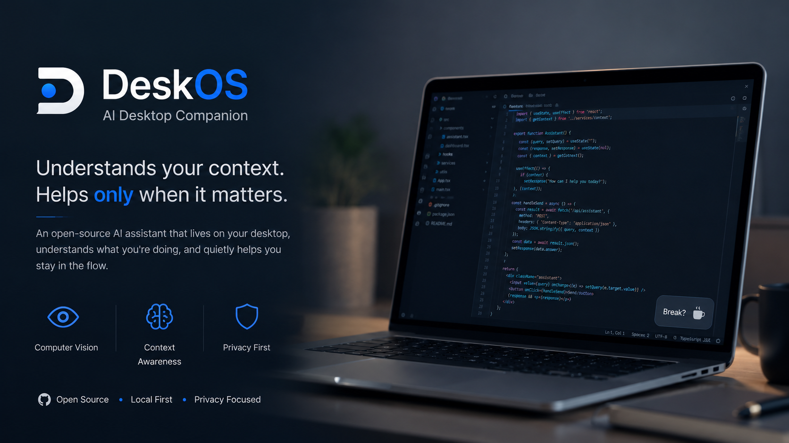

<p align="center">
  
</p>

<p align="center">
  Runs entirely on your machine. Stays quiet unless speaking up actually creates value.
</p>

<p align="center">
  <a href="https://github.com/datazenith-labs/DeskOS/actions/workflows/ci.yml">
    
  </a>
  
  
  
  <a href="https://github.com/astral-sh/ruff">
    
  </a>
  
</p>

---

## What DeskOS is

Most desktop assistants are chat windows you have to open, ask, and close.
DeskOS is the opposite. It sits quietly in a corner of your screen,
recognises whether you are coding, studying, taking a break, or away from
your desk, and stays silent unless there is a genuine reason to speak.

The measure of success is unusual: if you can leave it running all day
without being annoyed by it, it works.

**What DeskOS is not:** a chatbot, a productivity dashboard, a notification
firehose, or a service that uploads your screen or camera anywhere.

---

## Status

Alpha. The assistant bubble, webcam context detection, suggestion widget
and the silence rules all work today. The focus timer is a placeholder,
and voice interaction and desktop automation have not been started.
Known bugs, and the plan for fixing them, are tracked openly in
[docs/REVIEW.md](docs/REVIEW.md).

---

## Quick start

**Requirements:** Windows, macOS, or Linux with Python 3.10 or newer.
Get it from [python.org/downloads](https://python.org/downloads). On
Windows, tick **"Add Python to PATH"** during installation.

1. Download and extract this project anywhere, for example your Desktop.
2. Open the extracted `DeskOS` folder.
3. **Windows:** double-click `launch.bat`.
   **macOS or Linux:** open a terminal in the folder and run `./launch.sh`
   (first time only, run `chmod +x launch.sh` beforehand).

The first run creates an isolated Python environment and installs DeskOS
into it. This takes a few seconds. A small translucent bubble then appears
in the corner of your screen.

**Using it:** click the bubble to expand it into a chat panel. Type and
press Enter. Click `-` to collapse it back. Drag it anywhere; it remembers
where you put it.

**Stopping it:** close the terminal window, or press `Ctrl+C` inside it.

> **Linux:** if you see `ModuleNotFoundError: No module named 'tkinter'`,
> install it with `sudo apt install python3-tk` on Debian or Ubuntu, or
> `sudo dnf install python3-tkinter` on Fedora. Tkinter ships with Python
> on Windows and macOS but is packaged separately on most Linux systems.

---

## Context-aware mode

The default launcher runs the assistant bubble only. Webcam-based context
detection is opt-in, because it depends on `ultralytics`, which installs
PyTorch and is several gigabytes.

```bash
pip install -e ".[vision]"
python -m deskos.main
```

DeskOS then watches your webcam, infers what you are doing, and
occasionally shows a small suggestion.

---

## Privacy

- Everything runs locally. There is no account, no server, and no telemetry.
- Camera frames are analysed in memory and discarded immediately.
- The only data stored is a local SQLite database at `~/.deskos`, holding
  your context history and the feedback you explicitly give. Delete that
  folder at any time to reset DeskOS completely.

---

## How it works

Each stage does one job and hands a plain data object to the next:

```
Camera  ->  Perception  ->  Events  ->  Context  ->  Knowledge
                                                        |
                                                        v
             UI  <-  Services  <-  Decision  <-  Reasoning
```

- **Perception** reports what it literally sees. It makes no judgements.
- **Context** infers an activity: coding, studying, break, away.
- **Decision** is the sole gatekeeper. Confidence thresholds, cooldowns and
  repetition suppression live here and nowhere else, so the rules that keep
  DeskOS quiet cannot be bypassed by a new feature.
- **UI** shows at most one widget.

Every layer defines an abstract interface, so any implementation can be
replaced without touching its neighbours. Full detail in
[docs/ARCHITECTURE.md](docs/ARCHITECTURE.md).

---

## Design principles

1. **Understand context, not objects.** Seeing a coffee cup is not useful.
   Knowing you have been heads-down for two hours is.
2. **Silence is the default.** Before acting, DeskOS asks whether staying
   quiet would cost you anything real. Usually it would not.
3. **Never repeat yourself.** A dismissed suggestion does not come back.
4. **Learn only from explicit feedback.** Ignoring a suggestion is not
   rejection, and is never recorded as such.
5. **One widget at a time.** Nothing stacks, nothing steals focus.

---

## Development

```bash
git clone https://github.com/datazenith-labs/DeskOS.git
cd DeskOS
python -m venv .venv
source .venv/bin/activate      # Windows: .venv\Scripts\activate
pip install -e ".[dev]"

pytest                         # run the test suite
ruff check .                   # lint
ruff check . --fix             # auto-fix lint issues
```

CI runs `ruff` and `pytest` on Python 3.10 through 3.14 for every push and
pull request.

Contributions are welcome. Please read [CONTRIBUTING.md](CONTRIBUTING.md)
first: DeskOS is opinionated about restraint, and a change that makes it
noisier will be declined even if the code is good.

---

## License

MIT. See [LICENSE](LICENSE).